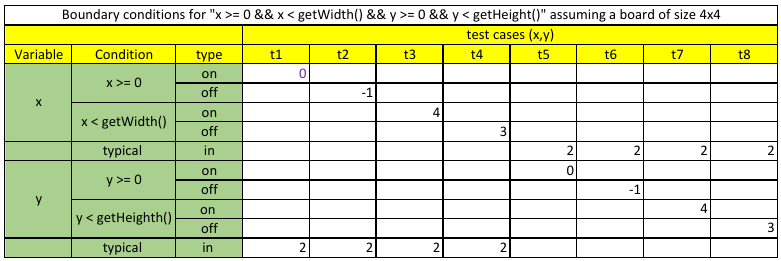

# Software Quality & Testing Report

## Assignment 0

### Question 3

The reason why we can not exhaustively test our entire software project is because even if it does not include many branches, inputs and outputs, it would be realistically impossible to test all possible combinations of input values. Instead we should for example prioritise the combinations of values that are most common or that are most likely to cause faults.

### Question 4

The pesticide paradox says that like a pesticide, testing only gets rid of those bugs that the test cases cover. The consequence of this paradox is that once you have run the same tests over and over again, no new information can be derived as no new bugs will be found. In addition, more subtle bugs will not be detected by these tests. This implies for software testers that we have to constantly write new test cases as we cannot depend on old test cases made a long time ago to find new bugs.

### Question 5

We should automate the test execution process as much as possible because this is the part of the testing process that depends least on human input, is prone to human error, is rather monotonous and thus lends itself best to automation.

## Assignment 1

### Question 6

`DefaultPlayerInteractionMap` and `CollisionInteractionMap`, the code in these classes is not called directly or indirectly by the smoke test. This is because the `DefaultPlayerInteractionMap` is a class meant to enable future extensions to the collision system, but is currently not used. The `CollisionInteractionMap` is in turn only used by this class, therefore it is unused as well.

### Question 7

Yes, it is covered. When commenting out the line that moves the player, the player does not consume the pellet on the square it has moved to, therefore not getting ten points for the pellet. This can be used as an indicator of that fact that indirectly obtaining points by moving on the board functions correctly. It however is of limited use as it does not make clear in what part the defect is present, it covers multiple methods from multiple classes.

### Question 8

This change causes the neighbour maps of the squares to receive the incorrect squares. Specifically for `Direction.EAST`, this results in the east neighbour of a square to be the exact same square. Moving the player to what should be the east will result in it staying on the same square. This in turn causes the player to not get any points, for the reasons established in question 7. Again it was not trivial to establish all this, because the behaviour spans many methods and classes. In conclusion, end-to-end testing such as this is only useful for establishing the presence of faults, not where or under what exact circumstances. More in-depth testing such a unit testing is needed for that.

### Question 9

`Game` together with its concrete implementation `SinglePlayerGame` appears to function as a sort of container that holds most of the other classes either directly or indirectly. It coordinates the communication between these classes and handles the lifecycle of the game - setting it up and tearing it down. `Level` is concerned with the board, the player and the NPCs. It handles collisions between these and can notify other classes that the game has ended. `Board` contains the grid of `Square`s and its dimensions, and enables other classes to obtain squares and check the validity of coordinates. `Unit` is a generic representation of moving characters on the board. It enables the movement of characters across the board.

### Question 12

